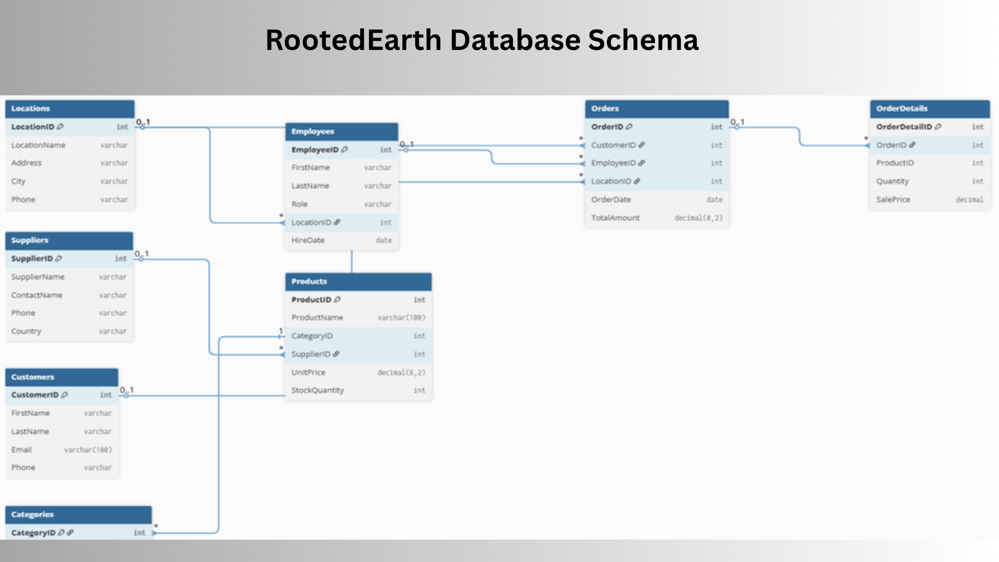
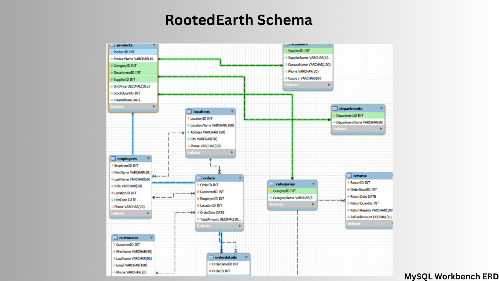

# RootedEarth Database – Retail Analytics

## Overview
This project simulates real-world business operations and demonstrates how SQL can be used to transform raw transactional data into actionable insights.

It analyzes business performance across revenue, inventory, and customer behavior using SQL.

---

## Database Design
- Normalized relational schema
- Multiple interconnected tables (Customers, Orders, Products, etc.)
- Primary & foreign key relationships

---

## Data Analysis
The `queries.sql` file contains real business-focused analysis, including revenue breakdowns, inventory tracking, and customer behavior insights.

Developed 17+ SQL queries to analyze:

- Monthly, weekly, and yearly revenue
- Inventory performance
- Customer purchasing behavior
- Sales across locations

---

## Files Included

- `01_create_tables.sql` – database structure  
- `02_insert_data.sql` – sample data  
- `03_indexes.sql` – performance optimization  
- `04_queries.sql` – business analysis queries  

---

## Database Schema (Simplified View)

---

## Full ERD (Technical View)

---

## Key Insight
Identified patterns in product performance and revenue distribution, demonstrating how structured data analysis supports business decision-making.

## Final Note
This project demonstrates my ability to design structured data systems and apply SQL to generate actionable business insights—bridging technical implementation with real-world analytics.
