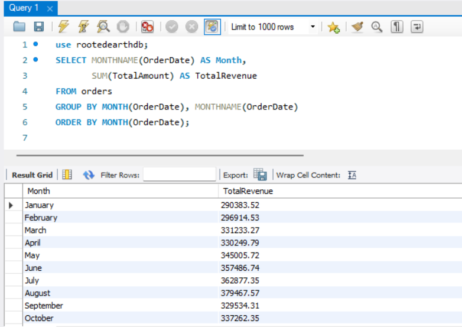
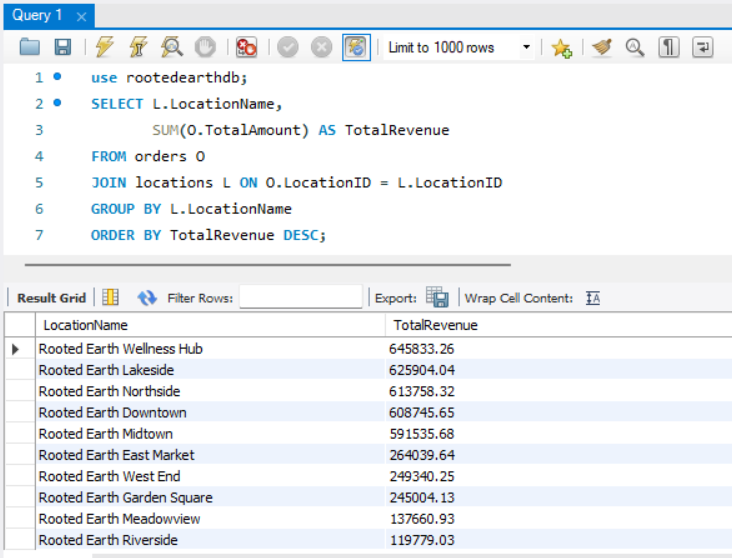
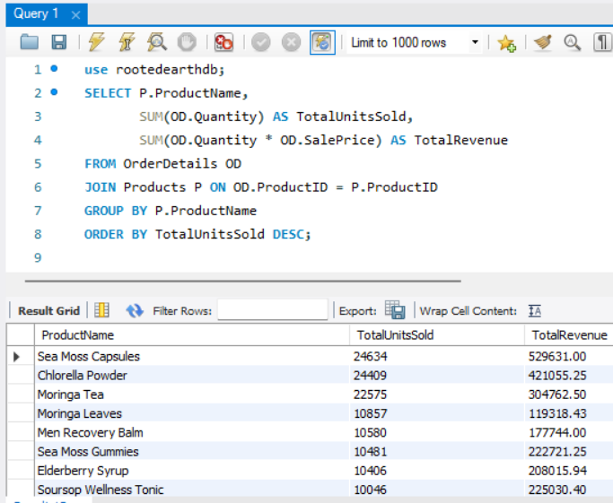

# RootedEarth Database – Retail Analytics

## Overview
This project simulates real-world business operations and demonstrates how SQL can be used to transform raw transactional data into actionable insights.

It analyzes business performance across revenue, inventory, and customer behavior using SQL.

---

## Database Design
- Normalized relational schema  
- Multiple interconnected tables (Customers, Orders, Products, etc.)  
- Primary & foreign key relationships  

---

## Data Analysis
The `queries.sql` file contains real business-focused analysis, including revenue breakdowns, inventory tracking, and customer behavior insights.

Developed 17+ SQL queries to analyze:

- Monthly, weekly, and yearly revenue  
- Inventory performance  
- Customer purchasing behavior  
- Sales across locations  

---

## Views (Reporting Layer)

To support efficient and repeatable analysis, this project includes SQL views that act as a reporting layer.

These views simplify complex joins and provide business-ready data for analysis and visualization tools.

Examples include:

- Monthly revenue summaries  
- Product performance metrics  
- Customer purchase insights  

Using views allows for cleaner queries, improved readability, and faster analysis, especially when integrating with tools like Power BI.

---

## Files Included

- `01_create_tables.sql` – database structure  
- `02_insert_data.sql` – sample data  
- `03_indexes.sql` – performance optimization  
- `04_queries.sql` – business analysis queries  

---

## Data Design Considerations

To balance realism and performance, transaction data was generated using sampled days rather than every calendar day.

Each month contains a subset of active transaction days, allowing for:

- Meaningful revenue trends  
- Realistic variation in sales activity  
- Efficient query performance  

This approach ensures the dataset remains manageable while still supporting accurate business analysis.

---

## Database Schema (Simplified View)


---

## Full ERD (Technical View)


---

*Note: Views are used as a reporting layer and are not shown in the ERD.*

---

## Business Insights & Analytics

### 1. Monthly Revenue Trends

Understanding revenue trends helps identify patterns in sales performance over time.

**The Query:**

```sql
SELECT MONTHNAME(OrderDate) AS Month,
       SUM(TotalAmount) AS TotalRevenue
FROM orders
GROUP BY MONTH(OrderDate), MONTHNAME(OrderDate)
ORDER BY MONTH(OrderDate);
```

**Insight:**  
Revenue shows a steady increase throughout the year, peaking in August ($379,467.57). This indicates a strong summer season and helps guide inventory and staffing decisions.



---

### 2. Revenue by Location

Comparing store performance helps identify top-performing locations and areas that may need improvement.

**The Query:**

```sql
SELECT L.LocationName,
       SUM(O.TotalAmount) AS TotalRevenue
FROM orders O
JOIN locations L ON O.LocationID = L.LocationID
GROUP BY L.LocationName
ORDER BY TotalRevenue DESC;
```

**Insight:**  
This highlights which locations are generating the most revenue, making it easier to recognize strong performers and investigate underperforming stores.



---

### 3. Best-Selling Products

Identifying top-selling products helps guide inventory planning and marketing strategy.

**The Query:**

```sql
SELECT P.ProductName,
       SUM(OD.Quantity) AS TotalUnitsSold,
       SUM(OD.Quantity * OD.SalePrice) AS TotalRevenue
FROM orderdetails OD
JOIN products P ON OD.ProductID = P.ProductID
GROUP BY P.ProductName
ORDER BY TotalUnitsSold DESC;
```

**Insight:**  
This reveals the core products driving revenue, allowing the business to prioritize stock levels, promotions, and customer retention strategies.

